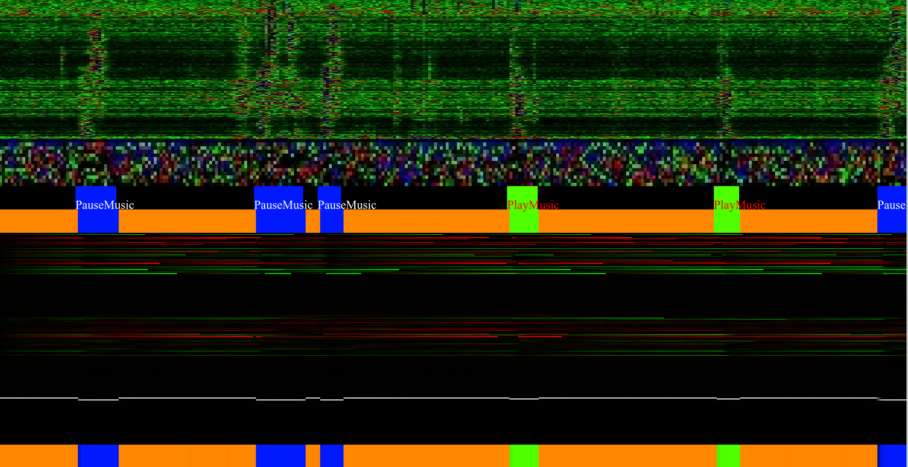

**Abstract**
============
It is desirable to have a model which takes as input a stream of audio and returns the action which the user is currently telling the machine to perform.
Given a good set of labeled audio, it is relatively easy to train a Long Short-Term Memory (LSTM) model to do this.
However obtaining such a set of labeled audio is difficult.
We present Aural2, a data collection and labeling infrastructure which helps users to quickly collect high value training data with which it trains an LSTM model to accurately transform a stream of audio into the probability, for any given action, that the user is currently telling Aural2 to perform it.
The models trained by Aural2 are usually capable of correctly classifying the user's intent before the user has finished speaking; assuming latency to be measured from end of utterance, they has slight negative latency.
Furthermore, the model will learn to integrate past context into its classifications, allowing it to learn to accurately solve the use-mention distinction[^1], and ignore commands directed at other voice assistants, all without itself requiring the use of wake-words.

We describe the architecture of Aural2, its advantages over existing
systems, its failings, and future directions for development.

**Introduction**
================

It is often useful for users to be able to control machines via voice.
To do this, we need a model that takes a real time stream of audio and returns the action which the user wishes the machine to perform.
There exist many systems which perform this task.[^google_home][^amazon_echo][^apple_siri]
Most of these systems first transcribe the audio into text using full vocabulary speech to text (STT), and then use word level natural language parsing (NLP) systems on the resulting text.[^2][^3]
NLP on top of STT has numerous advantages.
Behaviors may be written purely in text, making development of new skills easy.
Assuming sufficiently advanced NLP, arbitrarily complex instructions may be transmitted from user to machine.
Even if the NLP used is not sufficiently powerful to understand the full complexity of human language, it can still understand multi dimensional commands.[^alexa_slots]

However, such systems fall short in certain respects.
Text contains less information than the audio from which it was transcribed.
STT loses important information regarding inflection and tone.
Purely from an information theory perspective, we should expect a system based on NLP on top of STT to be less accurate than a system which processes sound into actions directly.

Even the most advanced NLP systems are unable to reliably differentiate between the mention of a word and its use, especially in context poor situations.
To prevent spurious actions, most voice control systems require that the user speak a predefined wake word not found in normal language before each command.

Both STT and NLP require significant data to train and hardware to run.[^deep_speech]
This makes them difficult to run on resource constrained devices, requiring that audio be sent to more powerful hardware in the cloud for processing.
Constant streaming of audio is costly on bandwidth and a potential privacy risk, not to mention that it incurs at least one round trip of latency to the nearest data center.
To minimize the audio sent to the cloud, most voice control systems require that the user speak a locally detectable wake word to trigger audio transmission only when needed.

Both because current NLP is unable to solve the use-mention distinction with sufficient accuracy, and because STT and NLP are too expensive in RAM and CPU to run on inexpensive hardware, most current systems must require users to speak a wake word which is both uncommon in normal speech and can be detected by the small amount of local audio analytics before speaking any command.
Coupled with the latency incurred by data transfer to and from the cloud, traditional voice interfaces are painfully slow in comparison to in person interaction with a human.

A system built around Aural2 can run on relatively inexpensive hardware and can solve the use-mention distinction with far better accuracy than most voice assistants thereby allowing it to be used with no wake word.
Not only does it not incur the latency of network communication, but it can correctly classify the user's intent somewhat before the user has finished speaking, compensating for whatever other latency may be unavoidable in the system.

However, to achieve these advantages, Aural2 must make significant sacrifices in other areas such as number and complexity of actions, rendering it unsuitable for many applications.

[^google_home]: https://store.google.com/product/google_home
[^amazon_echo]: https://www.amazon.com/gp/product/B0749WVS7J
[^apple_siri]: https://www.apple.com/ios/siri/
[^alexa_slots]: https://developer.amazon.com/docs/custom-skills/define-the-interaction-model-in-json-and-text.html
[^deep_speech]: https://github.com/mozilla/DeepSpeech

# Technologies used
## TensorFlow Compute Graph (TF graph)

TensorFlow (TF) Compute Graph is a purely functional language for
defining graphs of transformations on tensors, which the TensorFlow
runtime lazily evaluates using the best hardware available at runtime.
Each node in the graph takes zero or more tensors as input, and returns
one or more tensors as output. As recursion and loops are forbidden, TF
compute graphs are provably halting, execute in approximately fixed
time, and are not Turing complete. A TF graph can be stored as a
GraphDef protobuf file. This GraphDef is cross platform, able to be
evaluated by the TensorFlow runtime on any supported hardware, whether
that be an x86 or ARM CPU, or NVIDIA GPU.

A tensor in this context is an n dimensional array of numbers. The shape
of a tensor is denoted with a list of its dimensions. For example, \[1,
2, 3\] denotes a three dimensional tensor; a list containing one list of
two lists of three numbers. All numbers are float32 unless otherwise
noted.

Although it is possible to write a text encoded GraphDef by hand, it is
far more common to construct the graph using some more general purpose
language such as Python[^4] or Go[^5], either for export as a GraphDef
for later use, or for immediate evaluation.

Aural2 does both: constructing the main training graph in python at
build time, and the numerous other supporting graphs in Go at
initialization time.

Aural2's extensive use of TF compute graphs allow it to take advantage
of dedicated hardware accelerators such as NVIDIA GPUs, while still
running with full capabilities, albeit somewhat slower, on a generic
CPU.

**Mel-frequency cepstral coefficient (MFCC)**
---------------------------------------------

It is computationally expensive to train a neural net directly on the waveform of audio[^6].
Therefore, it is common practice to train the NN on fingerprints of windows of the waveform[^7].
A Fourier transform of a window of audio reduces it to the a list of amplitudes in the frequency domain.
Mel-frequency cepstral coefficient (MFCC) remaps the frequency domain information produced by a Fourier transform to a scale optimized for human speech.
In the configuration used in Aural2, MFCC uses 13 frequency bins each represented as a float32.

**Long short-term memory neural nets (LSTM)**
---------------------------------------------

An LSTM can be thought of as a Recurrent Neural Net (RNN) augmented with
persistent memory[^8].

Each cell of an RNN takes as input the output of the previous cell concatenated with the input information and returns an output which is sent to the next cell.
This allows them to recognise patterns in time series data of arbitrary length.
However, for reasons[^9], RNNs have difficulty remembering long term state.
LSTMs solve this problem by augmenting an RNN with persistent memory which it can read from and write to, thereby allowing it to persist information for arbitrarily
long periods.

Aural2 currently uses a stack of two LSTMs, the first taking as input
the series of MFCCs of audio, and the second taking the output of the
first and producing an embedding of the user\'s intent. Both LSTMs have
a state of size 64. As each LSTM is passing both the RNN's information
and the state of its memory forward, a total of 256 float32s are being
passed forward in each iteration.

# Architecture

\

## Elements

- **Microphone**: Measures air pressure. Returns a stream of 16,000 Hz int16 audio.
- **Step MFCC**: A TF graph which takes 1024 bytes of audio, or 512 samples, or ~32ms, of audio, and returns the `[13]` floats of an MFCC.
- **Step inference LSTM**: Every ~32ms, takes an MFCC from Step MFCC, updates the `[256]` memory of the LSTM accordingly, and returns `[50]` `softmax`ed probabilities for each intent.
- **vsh**: Takes the list of 50 intent probabilities from the Step inference graph, and, if the threshold is reached, triggers an action.
- **10 Second Ring buff**: Takes audio from the microphone, and stores it for 10 seconds. When triggered by vsh, writes the past 10 seconds of audio to the file system.
- **Raw audio on FS**: Stores 10 second clips of raw audio given to it by the ring buffer.
- **Labeling UI**: Displays each clip to the user, who labels durations within which a non nil intent was expressed.
- **MFCC Graph**: Takes a whole 10 second clip of audio and returns the `[312, 13]` MFCCs for the whole clip.
- **Map of MFCCs**: Stores slices of 312 MFCCs.
- **Label sets in DB**: Stores sets of user created labels for each clip.
- **Sampler**: Converts a set of periods of intent into a list of 312 integer intent IDs.
- **Map of Targets**: Stores slices of intent IDs.
- **Mini-batch generator**: Takes corresponding slices from corresponding elements from the map of the MFCCs, and the map of targets, and combines them into a (`[7, 100, 13]`, `[7, 100]`) mini-batch, which is written  to the buffered channel.
- **Buffered Channel**: Holds a buffer of, at most, 3 mini-batches.
- **Train LSTM**: Reads mini-batches from the buffered channel, computes loss on the current state of the variables, and backpropagates this loss over the variables.

Note that the step inference and training LSTM graphs share weight and
bias variables.

There are also various TF graphs for generating visualizations of data which are not shown.
These graphs will not be discussed in detail here.

## Hyperparameters

- **Sequence length**: The number of LSTM cells to unroll when training. Currently 100, which at current window size is ~3 seconds. Higher values mean slower build and training. Shorter values cost ability to learn long commands. Note that the inference graph is unaffected by sequence length; it only apples when training using backpropagation.
- **Clip duration**: The duration of each saved clip of audio. Currently 10 seconds. Must be somewhat longer than the duration of the longest command + the time needed for the user to recognize a mistake and tell Aural2 to save audio. The user must listen to the whole clip when labeling, so excessively long clips waste the user's time.
- **Window size**: The number of samples of audio to use in each MFCC. Currently 512 samples. Smaller windows will increase time resolution, and therefore compute cost, at some (probably small) cost to the models ability to learn long term patterns. Extremely small windows will cost low frequency accuracy.
- **MFCC size**: The number of bins in the MFCC. Currently 13 because that was the default in the TensorFlow implementation. Larger values will get better frequency resolution at some cost to model size and compute cost.
- **Mini-batch size**: The number of labeled sequences on which to compute loss when training. Currently 7. Larger values will result in better accuracy in loss calculation, and consequently smoother gradient decent along with less training overhead, but with greater compute cost per mini-batch.
- **LSTM state size**: The number of float32s in which the LSTM stores its state. Currently 64. Larger values allow the model to remember more complex state while requiring more memory and compute. Extremely large values will allow overfitting.

## LSTM Model
Aural2 uses a fairly standard stacked LSTM.
Sound is recorded at a sample rate of 16,000 Hz with 16-bit depth.
512 sample windows of this audio are fed into a TF graph to compute the MFCC, producing a tensor of shape \[13\].
This tensor is used as the input to the first LSTM.
This LSTM produces an output of the same size as its state which is used as the input for the second LSTM.
The output of the second LSTM is `matmul`ed, and `softmax`ed into a list of 50 floats between 0 and 1.
The $n$th element of this list is the probability that the world is in state $n$.
As the world can be in one and only one state, the probabilities of the various states must sum to 1.

### Loss
When training, we try to minimize the loss of the model.
In this context, loss is calculated as the sum of the square of the differences between actual and target.

Recall that the actual and target are lists of one-hot embedded states.
Take the example of a vocabulary of 3 states.
Looking at only one time step, if the target is [0.0, 1.0, 0.0], and the actual is [0.6, 0.3, 0.1], the loss is:

$$
(0.0 - 0.6) ^ 2 + (1.0 - 0.3) ^ 2 + (0.0 - 0.1) ^ 2 =
$$
$$
-0.6^2 + 0.7^2 + 0.1^2 =
$$
$$
0.36 + 0.49 + 0.01 =
$$
$$
0.86
$$

We see that a model can minimize its loss by reducing the differences between its actual output and the target.
Due to the nonlinearity of squaring, large differences in one element of the output are punished disproportionately.
The model is therefore cautious in the absence of good information.
If the information which the model possesses is of approximately equal likelihood to be observed in worlds which are in each of the three states, a good model will output ~0.33 for all outputs so as minimize loss.

### Causality
Let us assume a world which can be in any of three states, 0, 1, or 2.
At each time step, it can change its state.
However most of the time, its state does not change.
We can model this world as a Markov chain where the strength of each node's connection to itself is at least an order of magnitude greater than the strength of its connections to other nodes.
We cannot directly observe the state of the world.
However, there exist a few bits of information whose states at each time step occur with different frequency and in different patterns depending on the past and present state of the world.
This information we can observe.

A single time step of information often appears in multiple states with similar frequency; it gives us only weak evidence of the state our world is currently in.
From a single time step, we cannot reduce the list of states which we could be living in to one.
We must observe the information for multiple time steps if we are to confidently know the exact world we live in.
While the world has been in state $a$ for many past time steps, we have a strong prior of the world being in state $a$.
The absence of strong evidence of not being in state $a$ is sufficient to give us a reasonably strong belief that the word is in state $a$.
However, if the state changes, if we have strong evidence that the world is no longer in state $a$, we no longer have good priors, and must observe many time steps of information to gain strong beliefs about the current state.

Imagine a simple LSTM.
For the past many steps it has been observing patterns of information which occur with far greater frequency in world of state 0.
Say that the probably of the world transitioning from state 0 to state 0 is 0.9, and probabilities of state 0 transitioning to states 1 or 2 are 0.05.
Given that the world is in state 0, there is a high prior probably that it will be in state 0 in the next time step.
But if the LSTM observes information which is very rarely observed when in worlds of state 0, this is evidence sufficient to overcome the strong prior probably and stop believing that it is in a world of state 0.
However this new information is often observed with approximately equal frequency in worlds of state 1 and state 2.
Although it knows that it is not in state 0, it does not know whether it is in state 1 or 2.
Recall that loss is calculated as the square of the difference between the models outputs and the true state of the world.
The LSTM will therefore output a probabilities of, for example, 0.06 for state 0, and probabilities of 0.47 for 1 and 2.
As it observes new information, it updates the probabilities that it is in worlds 1 and 2.
After observing many time steps of information more likely to be observed when in, for example, state 2, it will once again assign a probability of, for example 1.96 to being in state 2, and assign a high prior probability to being in state 2 next iteration.

## vsh
The LSTM model outputs a list of probabilities of intents every 32ms.
While far more useful than before, this format of information is still not maximally convenient for our purposes.
The simple preprocessing layer used by Aural2 is called Voice SHell, or vsh.
It is quite primitive and may be replaced by some more powerful system such as Intu[^intu].
However it has several important features necessary to make good use of the output of LSTM.

[^intu]: https://github.com/watson-intu/self

An LSTM trained by Aural2 tries to reduce loss.
A model which assigns high confidence to only the second part of the utterance "Play" being the `PlayMusic` intent has greater loss than a model which assigns high probability to every part of the utterance being the `PlayMusic` intent.
A model which assigns a probability of 0.6 to the utterance "Play" being the `PlayMusic` intent has greater loss than a model which which assigns a probability of 0.9 to the utterance being the `PlayMusic` intent.
The model wants to classify the whole utterance with high probability.
These same principles work in reverse.

As a result of this, when the user first begins to utter a command, the LSTM will output increased probabilities for the several intents which the user could be in the process of uttering.
Because the output probabilities must sum to 1, the several possible outputs will all individually be fairly low; beginning to utter a command causes the maximum probability to fall.
However, as the user utters more of the command, the LSTM will receive patterns of information which are frequently observed in worlds in which the user is commanding the machine to play music, and are very rarely observed in worlds in which the user is commanding the machine to prune the shrubbery.
With time, the probability for the `PlayMusic` intent will approach 1 while the probability for the other intents will approach 0.

Once the user is finished with their command and the world changes back to the nil state, the LSTM must again update its beliefs, this time reverting back to outputting close to 1 for the nil intent, and close to 0 for all others.

All of this takes place in the few hundred milliseconds during which the user is saying the word "Play".

vsh allows event handler functions to be registered for each of the outputs.
When an output is greater than the specified threshold, it is called.
A perfect LSTM will fire the `PlayMusic` every 32ms for the entire duration of the utterance.
While causing music to start playing several times will likely not cause significant harm, other intents are not safe to be called multiple times in quick succession.
Therefore, the primary task of vsh is to transform the LSTMs classification of the intent which the user is currently expressing, into single events which fire only once for each command.
This is easily achieve by the use of a boolean variable for each output which is set to `true` when the upper threshold is reached and the event handler is called, and `false` when the output falls below some lower threshold.
vsh then need only check for this variable, and call the event handler only if the variable is false.

In this way, vsh watches the output of the LSMT every 32ms and calls the appropriate event handler exactly once each time the user utters a command.
And as a side effect of the LSTM attempt to classify the whole duration of the utters, vsh call the event handler after only a small portion of the utterance has been spoke.
Thus, while information can not travel backwards in time, still, vsh on top of an LSTM trained on data labeled via Aural2 will take the appropriate action well before the user has finished speaking their command; if latency is measured from end utterance, it is negative.

# Training
## Desired behavior
Every ~32ms, the LSTM is given information about the current frequency distribution of incoming sounds.
We want it to return the probabilities that the world is in each of a finite set of possible state.

When we speak of world state in this context, we usually mean states such as "The user is currently telling the machine to play the music", or "The user is not telling the machine to do anything."
However Aural2 is extensible to any set of world states about which audio frequency distribution gives information.

Note that the vocabulary of states which a single model can classify must be exclusive.
It is not possible for a user to be telling the machine to play music and to pause it, at the same time.
These world states are exclusive and can be classified by the same model.
The user being happy, and wanting music to play, and being Alice, can all be true at the same time.
To classify the user's emotional state, intent, and identity, one would need three distinct vocabularies and corresponding models.
But in most usage, we merely wish to classify the intent which the user is currently expressing.
People almost always express zero or one intents at any given time.
Therefore, if we wish the model to classify the intent which the the user is currently expressed, we can use a softmax output with state 0 reserved for the nil intent.

As an example, imagine a vocabulary consisting of the states `nil`, `PlayMusic`, `SaveClip`, and `PruneShrubbery`, with indexes 0, 1, 2, and 3 respectively.
Imagine that, to begin with, the user is silent.
Every 32ms, the MFCC containing information about the world is given to the LSTM which writes it to its memory.
While the user is silent, we want the MFCC to output a value close to 1 for the `nil` state, and a value close to 0 for every other state.
Now imagine that the user wants the machine to play music, and therefore starts to say the word "play".
The LSTM will receive a few MFCCs containing the white noise which begins the word "play".
This is import information about the intent which the user is currently expressing.
As the past few seconds contained no utterances, the current utterance is probably using the word, not just mentioning it.
However there are multiple intents which, when expressed, begin with white noise.
Given the information available, the model can not know if the user is expressing the "PlayMusic" intent, or the "PruneShrubbery" intent, or if the white noise was produces by some other source.
We would therefore like it to output significant, but still less than 0.5, values for states 0, 1 and 3.

Each time a 32 millisecond window passes, a new MFCC is given to the LSTM with new information about the state of the world.
A new MFCC arrives, and this time, it does not contain much white noise and instead the frequency distribution looks quite like that of the "l" phoneme.
Assuming that the only intent which starts with a few steps of while noise followed by the "l" phoneme is the `PlayMusic` intent, we would like the LSTM to start to output a value close to 1 for state 1 of its output.
At this point, vsh, having received the `PlayMusic` intent with greater than 0.9 confidence, will start to play the music.
As the user continues speaking the word "play", we want the LSTM to continue to output a high value for state 1.
But as soon as the LSTM receives an MFCC of silence, we want it to go back to outputting a value close to 1 for state 0, and close to 0 for every other state.

This is the behavior which we would like the LSTM to exhibit.
While it would perhaps be possible to code such behavior by hand, it would be tedious, and likely inaccurate.

Instead, we train the LSTM on pairs of lists of input MFCCs and corresponding correct states.
To do this, we must first collect audio rich in interesting states, and then annotate this audio with correct state information.

## Data collection

As mentioned before, Aural2 maintains a ring buffer of the past 10
seconds of audio. At any time, the past 10 seconds can be written to
disk. This may be triggered by a REST API, or by the user saying
\"upload\", \"mistake\", or otherwise expressing their intent that the
audio should be saved. Clips of raw audio are stored as files in a
directory on the local storage. Metadata about the raw audio clip is
stored in a local boltDB[^11] or other key/value database.

### Labeling

Neural nets transform one dataset into another dataset. To use
supervised learning to train the neural net to turn the input data into
the *correct* output data, we must give Aural2 many examples of the
correct outputs for the various inputs. To help the user create this
information, Aural2 provides a web based labeling UI.

Aural2 serves an index page listing the audio clips which have been
captured, each clip name linking to the labeling UI for that clip. The
labeling UI for a given clip contains various visualizations of the clip
and the labels made by the current model when processing it. The
visualizations of the labels are automatically reloaded every \~second,
allowing users to watch the output of the model change in real time. The
user may listen to the audio, see visualizations of it, and create
labels defining the beginning and end of each period of any given state.
Once the user has labeled all periods in the clip during which a non nil
intent was being expressed, the label set is submitted back to the
server which both writes it to the local DB, and adds both the label set
and the corresponding audio clip to the training data object.

### **Training**

The training data object contains two maps, one of inputs and one of
targets, where each input is of shape \[312, 13\] and type float32 and
each target is of shape \[312\] and type int32.

When Aural2 starts, it reads the list of label sets from the boltDB and
the audio clips to which they refer, and adds them to the training data
object.

When a label set and clip are added to the training data object, the
clip is fed into the clip MFCC TF graph to transform it to a tensor of
shape \[312, 13\], which is added to the inputs map, and the label sets
are transformed into a list of the integer state ID at each of its 312
time steps, which is added to the targets map.

In this way, a set of preprocessed inputs and targets is created from
existing training data on startup, and added to when new labels are
submitted.

However, these are sequences with a length of 312 steps. To train an
LSTM on sequences of n time steps, one must unroll the cells, creating a
training graph containing n copies of the LSTM cell. It is
computationally expensive and unnecessary to train on 312 sample
sequences. Aural2 currently trains on 100 sample long sequences.

The data preparation loop is as follows:

- From the set of labeled audio clips, randomly select 7.
- For each clip:
  - At random, select two positive integers such that the second is less than 312, and exactly 100 more than the first.
  - From both the inputs and the targets for this clip, take the slice of 100 time steps defined by the two numbers previously selected.
- We now have 7 inputs of 100 time slices, and 7 corresponding targets of 100 time slices.

- Convert these two sets to tensors, a float32 input tensor of shape \[7, 100, 13\] and an int32 target tensor of shape \[7, 100\].

- Write this input-target pair to the minibatch channel, blocking until there are fewer than three mini-batches in the channel.

The training loop reads a mini-batch from the mini-batch channel and
evaluates the training LSTM graph on the inputs and targets, thereby
updating the weights and biases.

In this way, the training loop is always supplied with a buffer of mini
batches randomly drawn from a recent state of the training data, and
training data preparation is free to fully utilize CPU resources while the train
loop is blocked by the GPU doing training.

It should be reiterated that the graph used for performing inference on
incoming audio, the graph for performing batch inference on whole audio
clips for visualizations, and the training graph, while distinct graphs,
share a single set of variables. The weight and bias variables are
updated by the training graph, and the accuracy with which Aural2
classifies the state of the world increases. The variables stay on the
GPU, or whatever compute device TensorFlow has decided to use, and need
never leave. TensorFlow transparently handles locking to ensure that the
various graphs can read and write to the shared memory safely.

# Results
## Quantitative performance
The neural net used by Aural2 is continuously trained in real time from
a dynamically collected training set. The distribution of data added to
the training set changes depending on the environment and user, which
depend on the state of the Aural2 model.

For example, because the collection of training data is triggered by the `saveAudio` intent, all clips of audio contain the an utterance which some past state of the model thinks is the user telling it to save audio.
If the model is well trained, it will only contain true examples, but badly trained models will collect many false positives.
Because of this bias, the model quickly approach 0 false positives.

There is no standard training or test set for Aural2; each user is
encouraged to generate their own training set, and to keep saving and
labeling clips until Aural2 stops making too many mistakes. It is
therefore difficult to provide numbers describing Aural2s accuracy in a
reproducible manner.

## Comparison to alternatives
The closest systems to which we can compare Aural2 are the Google Home
and the Amazon Echo. Like Aural2, the Google Home and Echo respond to
voice commands to perform such actions as playing or pausing music.
However, unlike Aural2, they are unable to perform use-mention
differentiation and therefore require the use of a wake word not common
in everyday speech. Additionally, the only command which they are
capable of detection locally is the wake word; for all other speech
processing, they must send audio to the cloud and receive the results.
This is a privacy issue as well as incurring high latency. Contrast this
behavior to Aural2 which processes all audio locally, and can therefore
respond in time limited only by local compute speeds. As the LSTM used
by Aural2 is trained to label the whole duration of the utterance, it
will usually begin outputting the intent before the utterance is
finished; a whole utterance is unneeded to correctly classify an intent.

As Aural2 is trained locally, its model is trained on the user\'s voice
recorded from actual usage. There is no need to collect a diverse
training set; what would in any other model be overfitting to a single
user or small group of users is Aural2's correct and non-problematic
behavior.

An advantage of sending audio to the cloud for conversion to an intent
is that it allows such a system to use models running on servers in the
cloud, which can be far larger than any model suitable for running on
cheap edge devices.

Additionally, requiring a wake word has various advantages. As good as
Aural2's use-mention distinction is, it will eventually make a mistake.
However, if additional safely is desired, it is simple to train Aural2
to require that some prefix, "sudo" for example, be said before
particularly dangerous intents. Aural2 need only be taught that when the
user says "format disk", the user does not intend that the disk be
formatted, whereas when they user says "sudo format disk", the user does
want the disk to be formated. Aural2 will usually learn the distinction
with a few examples. For less dangerous intents, no prefix need be
required. In this way, the benefits of requiring a wake word may be
easily gained when desired, while still preserving the ease of
non-prefixed commands where very occasional false positives are not so
harmful.

## Coexistence with other voice assistants
We find that, from a few minutes of training data, Aural2 is well able to learn to ignore commands directed at other voice assistants.
Google home and Amazon echo can therefore be used in parallel with Aural2.

We invite readers to download Aural2 at https://github.ibm.com/ifleonar/aural2 so as to evaluate it for themselves.

## Shortcomings

Although perhaps superior to existing technology in latency, simplicity,
and speed of training, Aural2 currently uses one-hot embedding which
scales linearly with number of outputs. While the currently used
embedding size of 50 intents is fully sufficient for many tasks such as
controlling music, interacting with simple toys, or as a safety stop for
industrial equipment, it would likely be impractical for many thousands
of outputs, and as such, can have no ambition for use in full vocabulary
natural language parsing.

Additionally, Aural2 leaves much to be desired with regard to the
labeling of training data. While it can save audio on command, this
merely helps to collect unlabeled audio rich in states which the user
thought a past state of the model had misclassified; it does nothing to
label the audio with the true state.

A significant improvement to Aural2 would be to make use of user
feedback to directly train via reinforcement learning. This would
require an additional model to classify user voice, facial expressions,
etc, into an emotional state. This hybrid system of training an emotion
classifier via supervised learning, which can then be used to train an
intent model via reinforcement learning is however somewhat inelegant.

Another potential improvement would be to use a pair of one-hot embedded
outputs, one for intents and another for entities.
Whereas the current Aural2 outputs the action which the user wishes the machine to take, a dual embedding would allow Aural2 to classify arbitrary pairs of intent and
initiate.
This would allow a significantly larger portion of the space of commands to be represented
by the output.

[^1]: Use-mention distinction:
    [[https://en.wikipedia.org/wiki/Use-mention\_distinction]{.underline}](https://en.wikipedia.org/wiki/Use-mention_distinction)
    [[http://shomir.net/pdf/publications/swilson\_cicling11.pdf]{.underline}](http://shomir.net/pdf/publications/swilson_cicling11.pdf)

[^2]: https://developer.amazon.com/docs/custom-skills/define-the-interaction-model-in-json-and-text.html

[^3]: https://people.mpi-inf.mpg.de/\~smukherjee/Intent-Classification-WWW-2013.pdf

[^4]: Python, an open source programming language maintained by the Python Community https://www.python.org/

[^5]: Golang, an open source programming language developed by Google: https://golang.org/

[^6]: https://github.com/buriburisuri/speech-to-text-wavenet

[^7]: https://arxiv.org/pdf/1305.1145.pdf

[^8]: Recurrent Neural Networks:
    [[https://en.wikipedia.org/wiki/Recurrent\_neural\_network]{.underline}](https://en.wikipedia.org/wiki/Recurrent_neural_network)
    [[https://karpathy.github.io/2015/05/21/rnn-effectiveness/]{.underline}](https://karpathy.github.io/2015/05/21/rnn-effectiveness/)

[^9]: https://en.wikipedia.org/wiki/Vanishing\_gradient\_problem

[^10]: One-hot embedding: https://en.wikipedia.org/wiki/One-hot

[^11]: BoltDB: https://github.com/boltdb/bolt
